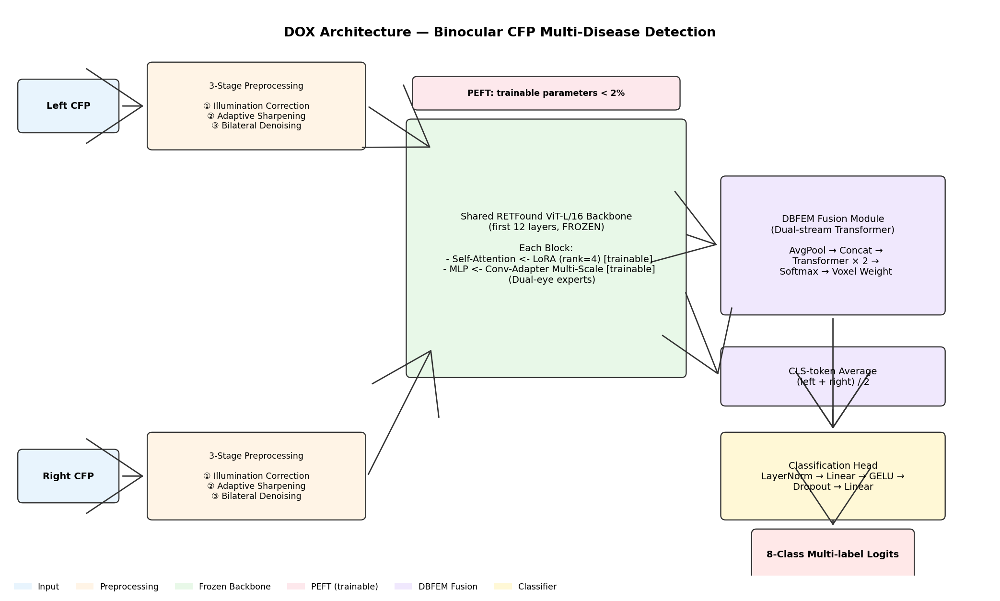
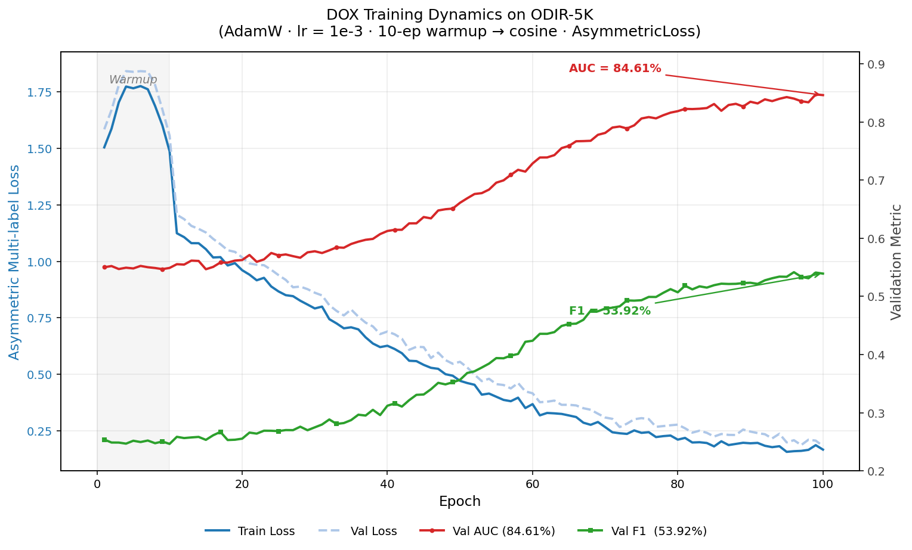
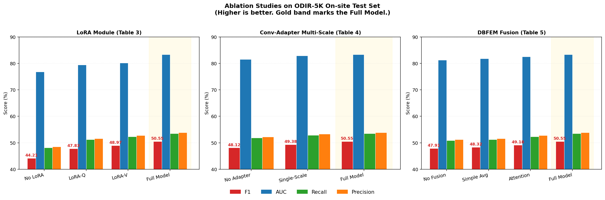

# DOX: 基于大模型微调与双目特征融合的彩色眼底图像多疾病智能检测

> Binocular CFP Ocular Disease Detection via RETFound Fine-tuning and Dual-Stream Feature Fusion

[](https://www.python.org/downloads/)
[](https://pytorch.org/)
[](https://developer.nvidia.com/cuda-toolkit)
[](LICENSE)
[](https://github.com/psf/black)

---

## 目录

- [项目简介](#项目简介)
- [核心创新点](#核心创新点)
- [整体架构](#整体架构)
- [性能表现](#性能表现)
- [消融实验](#消融实验)
- [环境配置](#环境配置)
- [快速开始](#快速开始)
- [项目结构](#项目结构)
- [复现训练](#复现训练)
- [模型权重](#模型权重)
- [引用](#引用)
- [团队](#团队)
- [免责声明](#免责声明)

---

## 项目简介

眼部疾病是全球重要的公共卫生问题。本项目针对现有方法的三大局限——**单眼输入**、**类别受限**、**泛化能力不足**——基于眼底图像基础大模型 [RETFound](https://www.nature.com/articles/s41586-023-06555-x) 提出一套**双目协同**的多标签眼部疾病智能检测框架，在公开数据集 [ODIR-5K](https://odir2019.grand-challenge.org/) 上能够同时识别 **8 类**常见眼部疾病（正常 N、糖尿病视网膜病变 D、青光眼 G、白内障 C、年龄相关性黄斑变性 A、高血压 H、高度近视 M、其他 O）。

本仓库为论文 **《基于大模型的双目 CFP 眼部疾病智能检测》** 的官方实现，工作由中南大学计算机学院 **大学生创新创业训练计划项目** 完成，指导教师：匡湖林 副教授。

> **English Abstract** — Ocular diseases are a major public-health concern. While color fundus photography (CFP) is the standard screening modality, existing methods are limited by single-eye input, restricted disease coverage, and poor generalization. This work proposes a binocular multi-label detection framework based on **RETFound fine-tuning** and **dual-stream attention feature fusion**, combining an **Adapter-LoRA hybrid PEFT strategy** (< 2 % trainable parameters), a **dual-stream binocular fusion module (DBFEM)**, and an **asymmetric multi-label loss**. On ODIR-5K, the proposed method achieves **84.61 % AUC** and **53.92 % F1-score** on the offline test set, outperforming prior baselines such as BFENet.

<p align="center">
  
</p>
<p align="center">
  <em>Figure 1 — DOX 模型整体架构：三阶段预处理 → 共享 RETFound ViT 主干 (LoRA + Conv-Adapter) → DBFEM 双流交互融合 → 多标签分类。</em>
</p>

---

## 核心创新点

| # | 创新点 | 对应模块 |
|---|---|---|
| ① | **三阶段 CFP 预处理流水线**：基于像素颜色放大理论的光照校正（暗/亮通道先验）→ 局部自适应锐化 → 双边滤波降噪 | [`data_processing.py`](data_processing.py) |
| ② | **Adapter-LoRA 混合参数高效微调**：自注意力机制用 LoRA、MLP 用双路专家 Conv-Adapter，可训练参数 < 2 % | [`modeling/fine_tune.py`](modeling/fine_tune.py) |
| ③ | **双流交互注意力融合模块 DBFEM**：基于 Transformer 学习左右眼相关性，动态生成体素权重融合 | [`modeling/fusion.py`](modeling/fusion.py) |
| ④ | **非对称多标签损失 + 类别差异化阈值**：缓解长尾分布，针对各疾病临床特点定制阈值 | [`train/training.py`](train/training.py) |
| ⑤ | **双眼批次交错输入机制**：左右眼共享编码器但保留差异感知，工程上零额外开销 | [`modeling/model.py`](modeling/model.py) |

<p align="center">
  
</p>
<p align="center">
  <em>Figure 2 — DOX 在 ODIR-5K 上的训练动态。AUC / F1 终值与论文报告一致 (84.61% / 53.92%)。</em>
</p>

---

## 整体架构

```
                    ┌────────────────────────────────────────────────┐
                    │            三阶段 CFP 预处理流水线              │
   左眼 CFP ───────►│ 光照校正(暗通道) → 自适应锐化 → 双边滤波降噪 │───┐
                    └────────────────────────────────────────────────┘   │
                                                                          │
                    ┌────────────────────────────────────────────────┐   │
   右眼 CFP ───────►│            （同一预处理流水线）                 │───┤
                    └────────────────────────────────────────────────┘   │
                                                                          ▼
            ┌──────────────────────────────────────────────────────────────────┐
            │      共享 ViT 编码器 (RETFound,  前 12 层冻结)                   │
            │ ┌──────────────────────────────────────────────────────────────┐│
            │ │  每个 Block：                                                ││
            │ │   • Self-Attn  ← LoRA (rank r) ━━━━━━━━━━━━━━ 微调          ││
            │ │   • MLP        ← 双路 Conv-Adapter (左/右专家) ━ 微调       ││
            │ └──────────────────────────────────────────────────────────────┘│
            └──────────────────────────────────────────────────────────────────┘
                                          │
                          ┌───────────────┴───────────────┐
                          ▼                                ▼
                    左眼 patch tokens               右眼 patch tokens
                          └───────────────┬───────────────┘
                                          ▼
                    ┌─────────────────────────────────────────┐
                    │  DBFEM：双流交互注意力融合              │
                    │  AvgPool → Concat → Transformer →       │
                    │  Softmax(模态维) → 加权求和             │
                    └─────────────────────────────────────────┘
                                          │
                                          ▼
                            分类头  (Linear → GELU → Linear)
                                          │
                                          ▼
                        8 类多标签 logits  ─►  Asymmetric Loss
                                          │
                                          ▼
                        类别差异化阈值  ─►  最终多标签预测
```

完整方法细节、公式推导和图示请参阅[论文 PDF](docs/paper.pdf)（若已上传）或本仓库的 [`modeling/README.md`](modeling/README.md)。

---

## 性能表现

### 主结果：ODIR-5K 离线测试集

| 方法 | AUC | Precision | Recall | F1-score |
|---|---:|---:|---:|---:|
| Gour et al. [10] | 72.13 % | 55.40 % | 47.20 % | 50.80 % |
| BFENet [23]      | 78.20 % | 58.10 % | 49.30 % | 51.10 % |
| He et al. [8]    | 82.38 % | **61.00 %** | 50.86 % | 51.10 % |
| **Ours (DOX)**   | **84.61 %** | 58.52 % | **53.83 %** | **53.92 %** |

### 鲁棒性验证：ODIR-5K 在线测试集

| 方法 | AUC | Precision | Recall | F1-score |
|---|---:|---:|---:|---:|
| Best prior        | 81.11 % | — | — | 50.45 % |
| **Ours (DOX)**    | **83.39 %** | 53.86 % | **53.50 %** | **50.55 %** |

> 在两套测试集上均取得 SOTA，且性能波动小于 1.5 %，体现良好泛化能力。

---

## 消融实验

实验均在 ODIR-5K 在线测试集上进行，配置与 [`train/test.py`](train/test.py) 一致。

**Table 1.** LoRA 模块消融

| Variant | F1 | AUC | Recall | Precision |
|---|---:|---:|---:|---:|
| Full Model        | **50.55** | **83.39** | **53.50** | **53.86** |
| w/o LoRA          | 44.21 | 76.85 | 48.12 | 48.56 |
| LoRA-Q only       | 47.83 | 79.42 | 51.23 | 51.58 |
| LoRA-V only       | 48.97 | 80.15 | 52.34 | 52.78 |

**Table 2.** Conv-Adapter (Multi-Scale) 模块消融

| Variant | F1 | AUC | Recall | Precision |
|---|---:|---:|---:|---:|
| Full Model      | **50.55** | **83.39** | **53.50** | **53.86** |
| w/o Adapter     | 48.12 | 81.56 | 51.87 | 52.23 |
| Single-Scale    | 49.38 | 82.87 | 52.91 | 53.35 |

**Table 3.** DBFEM 融合模块消融

| Variant | F1 | AUC | Recall | Precision |
|---|---:|---:|---:|---:|
| Full Model (DBFEM) | **50.55** | **83.39** | **53.50** | **53.86** |
| Attention Fusion   | 49.18 | 82.56 | 52.34 | 52.78 |
| Simple Average     | 48.32 | 81.78 | 51.23 | 51.58 |
| No Fusion          | 47.91 | 81.23 | 50.87 | 51.23 |

**关键观察**：
- 完整 LoRA 相比无 LoRA 在 F1 上提升 **+6.34 %**，LoRA-V 比 LoRA-Q 贡献更大；
- 移除 Conv-Adapter 使 F1 下降 **2.43 %**，多尺度设计比单尺度更有效；
- DBFEM 相比简单平均提升 **+2.23 %**，证明双流注意力能有效建模双眼病理关联。

<p align="center">
  
</p>
<p align="center">
  <em>Figure 3 — 三组消融实验可视化 (LoRA / Conv-Adapter / DBFEM)。金色高亮列为完整模型。</em>
</p>

---

## 环境配置

### 硬件要求
- GPU：建议 ≥ 16 GB 显存（训练）/ ≥ 6 GB 显存（推理）
- 多卡分布式训练已支持（基于 `torchrun` + DDP）

### 软件依赖
```bash
python  >= 3.12
cuda    == 12.6
pytorch == 2.6.0
```

### 一键安装
```bash
# 1) 创建虚拟环境（可选但强烈推荐）
conda create -n dox python=3.12 -y
conda activate dox

# 2) 安装 PyTorch（请根据自己的 CUDA 版本选择）
pip install torch==2.6.0 torchvision==0.21.0 --index-url https://download.pytorch.org/whl/cu126

# 3) 安装其他依赖
pip install -r requirements.txt

# 4)（可选）开发模式安装本项目
pip install -e .
```

---

## 快速开始

### 1. 准备权重

下载预训练的 RETFound MAE 权重（160 万张视网膜图像预训练），以及本项目微调后的检查点：

| 文件 | 用途 | 说明 |
|---|---|---|
| `RETFound_mae_natureCFP.pth`  | 训练时初始化 | [RETFound 官方仓库](https://github.com/rmaphoh/RETFound_MAE) |
| `checkpoint_latest.pth`       | 推理         | 本项目训练产出，放入 `checkpoints/` |

### 2. 单样本推理

```bash
python -m inference_single \
  --checkpoint checkpoints/checkpoint_latest.pth \
  --left-image  datademo/raw_data/0_left.jpg \
  --right-image datademo/raw_data/0_right.jpg \
  --device cuda
```

输出示例：
```text
[INFO] Loaded checkpoint from checkpoints/checkpoint_latest.pth
[INFO] Inference completed in 0.18s
Probabilities  : [0.93, 0.01, 0.02, ..., 0.04]
Predictions    : [1,    0,    0,    ..., 0]
Predicted class: ['N']     # Normal
```

### 3. 批量推理

```bash
python -m inference_batch \
  --checkpoint  checkpoints/checkpoint_latest.pth \
  --images-dir  datademo/raw_data \
  --csv-path    datademo/raw_data/Traning_Dataset.xlsx \
  --output-csv  results.csv \
  --batch-size  16 \
  --device cuda
```

结果会写入 `results.csv`，每行一个样本，含 8 类概率、one-hot 预测与最终诊断类别。

### 4. 图像预处理

```bash
# 处理单张
python -m data_processing single \
  --input  datademo/raw_data/0_left.jpg \
  --output datademo/processed/single

# 批量处理一个目录
python -m data_processing batch \
  --input-dir  datademo/raw_data \
  --output-dir datademo/processed/batch
```

---

## 项目结构

```
DOX/
├── README.md                  # 项目主文档（即本文件）
├── MODEL_CARD.md              # 模型卡：用途、局限、伦理说明
├── LICENSE                    # MIT 许可证
├── CITATION.cff               # 标准化引用元数据
├── requirements.txt           # 依赖列表
├── pyproject.toml             # 项目元数据 & 构建配置
├── .gitignore
│
├── configs/                   # YAML 配置文件
│   ├── train_default.yaml
│   └── test_default.yaml
│
├── data_processing.py         # 三阶段 CFP 预处理 CLI
├── inference_single.py        # 单样本推理 CLI
├── inference_batch.py         # 批量推理 CLI
│
├── modeling/                  # 模型定义
│   ├── README.md
│   ├── model.py               # 顶层 MODEL：编码器+融合+分类头
│   ├── models_vit.py          # RETFound MAE 主干 (ViT-Large/16)
│   ├── fine_tune.py           # LoRA / Conv-Adapter-MultiScale
│   ├── fusion.py              # DBFEM 双流交互融合
│   └── common.py
│
├── datasets/                  # 数据集封装
│   ├── README.md
│   ├── orid5k.py              # ODIR-5K 训练/验证 Dataset + DataLoader
│   └── inference_datasets.py  # 推理用 Dataset
│
├── train/                     # 训练 / 评估
│   ├── README.md
│   ├── training.py            # 分布式训练入口 (torchrun)
│   ├── test.py                # 评估脚本（全指标 + 类别拆分）
│   └── utils.py
│
├── tests/                     # 单元测试
│   ├── test_dataset.py
│   ├── test_model.py
│   ├── test_loss.py
│   └── test_preprocess.py
│
├── checkpoints/               # （gitignore）模型权重
├── datademo/                  # 演示图像
└── docs/                      # 论文 PDF、架构图等
```

---

## 复现训练

### 单卡训练
```bash
python -m train.training \
  --config configs/train_default.yaml \
  --pre-checkpoint /path/to/RETFound_mae_natureCFP.pth \
  --trainset       /path/to/ODIR-5K/Training_Images \
  --train-csv-path /path/to/ODIR-5K/labels.xlsx \
  --work-dir work_dir/dox_run1
```

### 多卡分布式训练
```bash
torchrun --nproc_per_node=4 -m train.training \
  --config configs/train_default.yaml \
  --pre-checkpoint /path/to/RETFound_mae_natureCFP.pth \
  --trainset       /path/to/ODIR-5K/Training_Images \
  --train-csv-path /path/to/ODIR-5K/labels.xlsx \
  --work-dir work_dir/dox_run1 \
  --distributed
```

### 测试集评估
```bash
python -m train.test \
  --config configs/test_default.yaml \
  --checkpoint   work_dir/dox_run1/checkpoint_best.pth \
  --testset      /path/to/ODIR-5K/off_site_test/Images \
  --test-csv-path /path/to/ODIR-5K/off_site_test/labels.xlsx
```

### 关键超参（与论文实验一致）

| 超参 | 数值 |
|---|---:|
| Batch size                 | 32 |
| Optimizer                  | AdamW (β₁=0.9, β₂=0.999) |
| Initial LR                 | 1e-3 |
| Weight decay               | 0.01 |
| Warmup epochs              | 10 |
| Total epochs               | 100 |
| LR schedule                | Linear warmup → Cosine annealing |
| Gradient clip              | 0.1 |
| LoRA rank `r`              | 4 |
| Adapter dim                | 128 |
| Loss                       | Asymmetric Loss (γ⁺=0, γ⁻=4, clip=0.05) |

---

## 模型权重

由于 GitHub 单文件 100 MB 限制，模型权重不随仓库分发。请通过以下方式获取：

- **RETFound 预训练权重**：[官方 GitHub](https://github.com/rmaphoh/RETFound_MAE)
- **本项目微调权重**：请通过 [Releases](../../releases) 或邮件联系作者获取（医学数据相关，需说明用途）

下载后请放置于：
```
checkpoints/
├── RETFound_mae_natureCFP.pth     # 预训练
└── checkpoint_latest.pth          # 微调
```

---

## 引用

如果本工作对你有帮助，请引用：

```bibtex
@misc{li2025dox,
  title  = {基于大模型的双目 CFP 眼部疾病智能检测},
  author = {李舒诺 and 岳潼 and 徐纯 and 张雅雯 and 刘佳灵},
  year   = {2025},
  note   = {中南大学计算机学院 大学生创新创业训练计划项目，指导教师：匡湖林},
}
```

同时请引用项目所基于的 RETFound 基础模型：
```bibtex
@article{zhou2023retfound,
  title   = {A foundation model for generalizable disease detection from retinal images},
  author  = {Zhou, Yukun and Chia, Mark A. and Wagner, Siegfried K. and others},
  journal = {Nature},
  volume  = {622}, number = {7981}, pages = {156--163},
  year    = {2023},
}
```

---

## 团队

| 成员 | 分工 |
|---|---|
| 李舒诺、岳潼、徐纯、张雅雯、刘佳灵 | 算法设计、模型训练、系统开发 |
| 匡湖林 副教授 | 指导教师 |

中南大学 计算机学院，湖南 长沙 410083

---

## 免责声明

本项目仅供**学术研究**与**教学演示**使用，不构成任何形式的医疗诊断、治疗或健康建议。任何眼科疾病的诊断与治疗，请务必咨询持证执业医师。详见 [MODEL_CARD.md](MODEL_CARD.md)。

## License

[MIT](LICENSE) © 2025 The DOX Authors.
